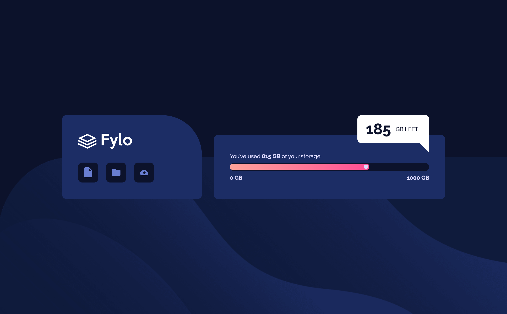
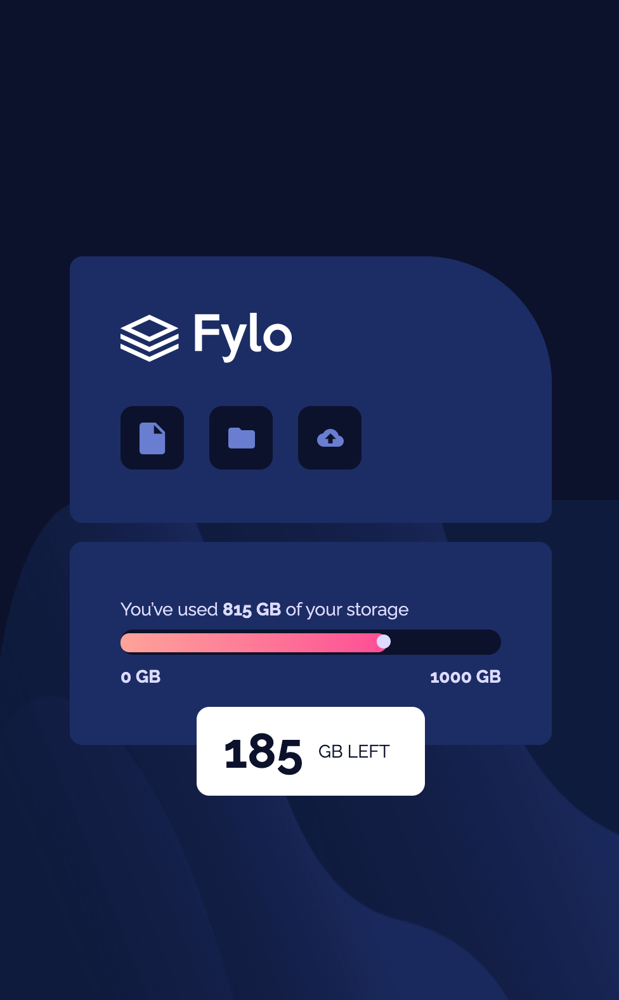

# Frontend Mentor - Fylo data storage component solution

This is a solution to the [Fylo data storage component challenge on Frontend Mentor](https://www.frontendmentor.io/challenges/fylo-data-storage-component-1dZPRbV5n). 

## Table of contents

- [Overview](#overview)
  - [The challenge](#the-challenge)
  - [Screenshot](#screenshot)
  - [Links](#links)
- [My process](#my-process)
  - [Built with](#built-with)
  - [What I learned](#what-i-learned)
  - [Useful resources](#useful-resources)
- [Author](#author)

## Overview

### The challenge

Users should be able to:

- View the optimal layout for the site depending on their device's screen size

### Screenshot

### Links

- Solution URL: [My Solution](https://github.com/rachanahegde/fylo-data-storage-component)
- Live Site URL: [Live Website](https://rachanahegde.github.io/fylo-data-storage-component/)

## My process

### Built with

- Semantic HTML5 markup
- CSS custom properties
- CSS Grid
- SASS

### What I learned

I taught myself CSS Grid using Wes Bos's CSS Grid course and SASS on Educative. This was a great opportunity to apply the concepts in those courses on a project where I had to write the code from scratch. 

### Useful resources

- [Wes Bos CSS Grid Course](https://cssgrid.io/)
- [SASS for CSS: Advanced Frontend Development](https://www.educative.io/courses/sass-for-css) 

## Author

- Website - [Add your name here](https://www.your-site.com)
- Frontend Mentor - [@yourusername](https://www.frontendmentor.io/profile/yourusername)
- Twitter - [@Rachana__H](https://www.twitter.com/yourusername)

